# Infix Expression Solver
Java based application to solve infix expressions and get results.
## Context
A Small Swing based Java application which lets us to solve infix mathematical expressions and get results based on some of the best known Object Oriented Design patterns.
## Flow diagram
Following is the data flow indicating, how the expression parsing and solving works in the given application.
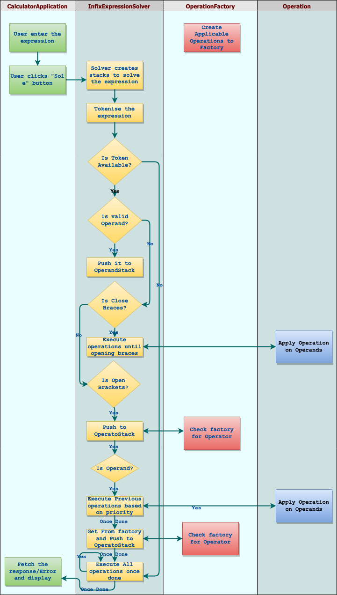

## Objective
Create a simple calculator which could be used to do basic operators like addition, subtraction, multiplication, division. The calculator should be able to evaluate multi operand expressions and should follow the bodmas rule. It should also support decimal numbers. Invalid expressions should be handled gracefully.

## Approach taken
Expression Solving is an interesting task, especially when it involves multiple operators with difference in priorites, or the order of execution.
- Stack based expression solving.
- Bodma's rule of executing the infix mathematical expression.
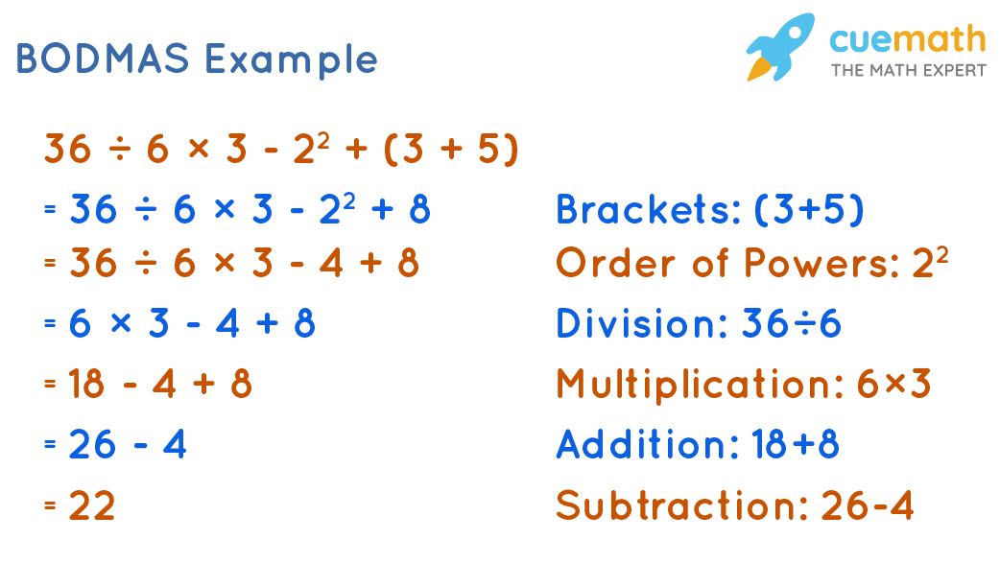
- Runtime exception creation and handling to ease the data flow with reliably specific exception processing.
- Efficient handling of data structures by localising them and explicitly creating when their job is done.
- Factory method pattern applied in creation/fetching of operator. This gives us the flexibility to add a new operators with minimal code changes.
- Inversion of control by employing the Sub version rule where the Generic Abstraction of Operator is invoked instead of the Specific Concretion of the exact implementation.
- Re-usability of code employed in all possible places efficiently, especially in the *InfixExpressionSolver* where the `popAndPerformOperation` method is reused in a self-contained and efficient way that it can be uses as a conditional operation tying to the other condition, which are varied in places.
- Immutability enables better efficient handling of data and resources. Immutable classes do promote object proliferation by only disabling object data modification. I have restricted object data change once it got created by not having any setters or Object changes. Either new instance is created or the same value is used through out.
- Lombok - used annotation based pre-processing to reduce a lot of boilerplate code that can be deferred to compile time.

## Possible enhancements
- Giving ability to work with Unary operators, the current implementation mostly works on the basis that all the operators are binary.
- Explicit exception handling instead of working with RuntimeExceptions. This way we will have a well-structured way of handling business exceptions effectively and explicitly.

## TDD
TDD has been enforced at every stage of the implementation. I have also tried to exercise the text pyramid where I have also covered all the functional testing of the application via unit/functional tests without mocks.

## Views
Following are the simple depiction of the infix caluclator application.
### Default
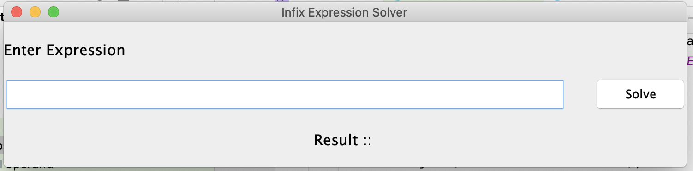

### Positive Results
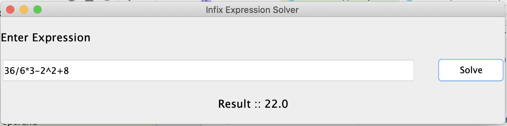

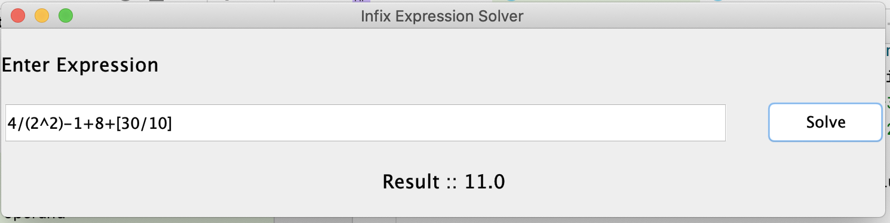

### Negative Results
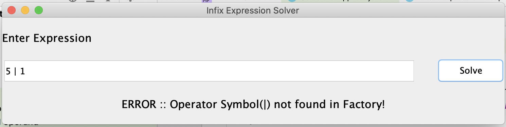

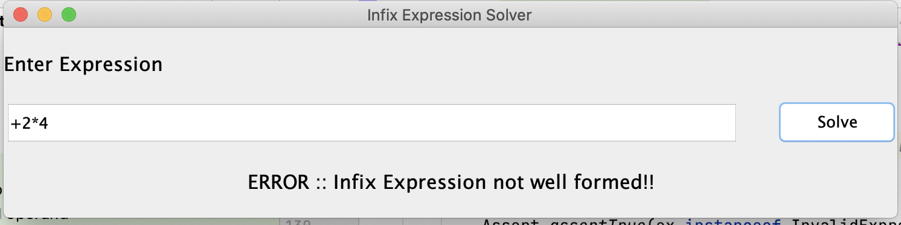

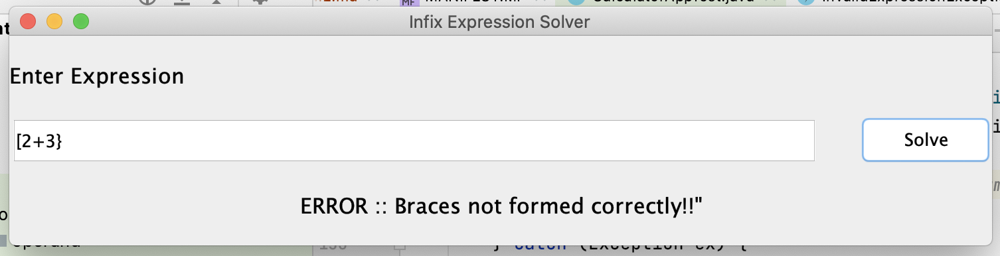

## Dependencies
Following are the dependent libraries that are used by the solver application.

## Tests
Following are the list of Unit tests and Integration tests that I have added as part of the application development.
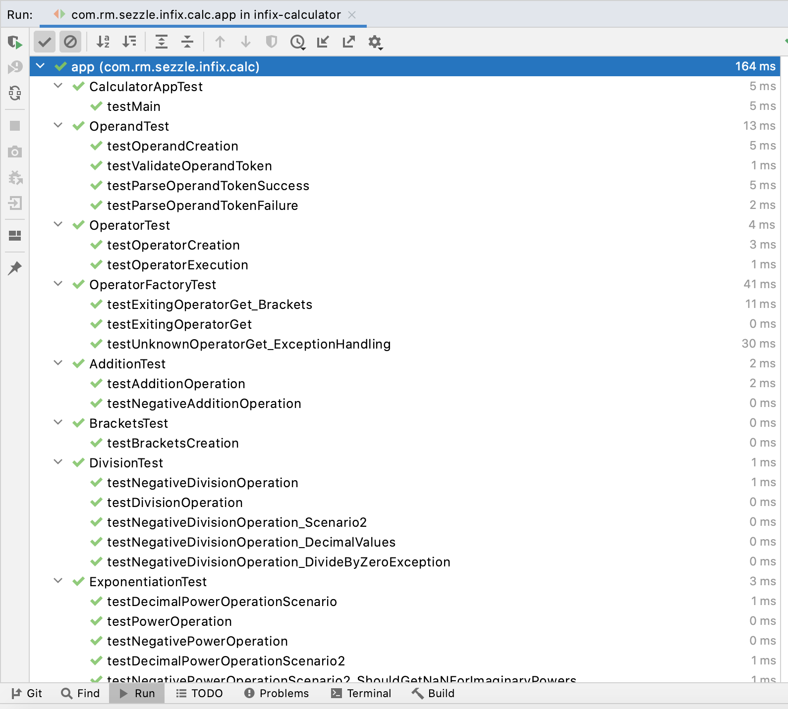

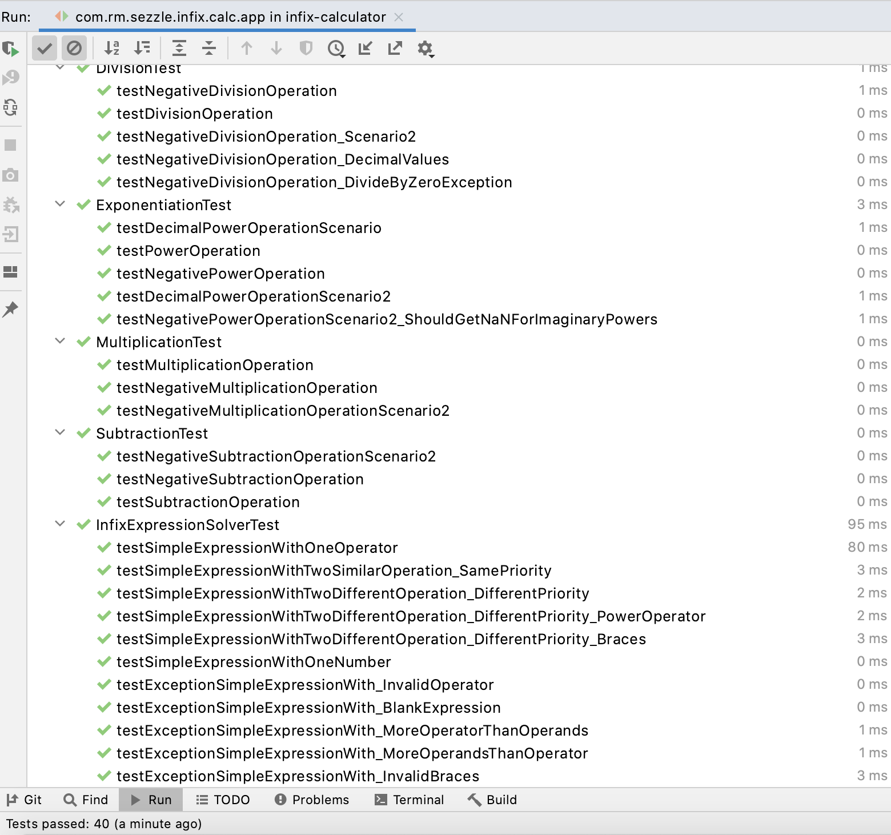

## Test Coverage
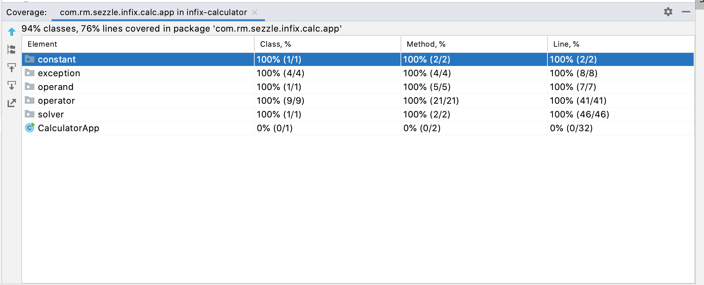

>         Developed in Jetbrain's IntelliJ IDE

## Running the app
I have created a runnable jar archive that lets us use the application. Which can be downloaded from [Here](./infix-calculator.jar)..

### build
`mvn clean install -U`

### run
`java ./infix-calculator/target/infix-calculator.jar`

## References
- Factory Pattern : https://dzone.com/articles/factory-method-design-pattern
- Basic Infix expression parsing : https://www.geeksforgeeks.org/expression-evaluation/
- Collection utils: https://www.journaldev.com/16635/collections-class-java-util-collections
- Runnable Jar: https://stackoverflow.com/a/5258323
- TextField Alignment: https://stackoverflow.com/a/12589611
- Dimension setting: https://stackoverflow.com/a/22920121
- Swing UI; https://www.guru99.com/java-swing-gui.html
- Changing fonts: https://stackoverflow.com/a/2715127
- Testing GUI using robots(didn't use): https://stackoverflow.com/a/16418685
- Major reference repo: https://github.com/rlama7/ExpressionEvaluator/
